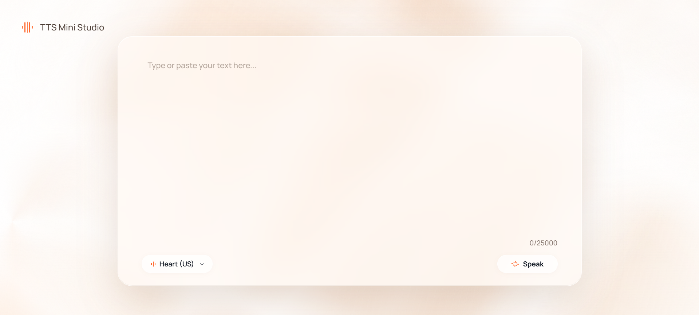

# TTS Mini Studio

Live Demo - https://apertso.github.io/tts-mini-studio



## What Is Where

- Backend API: `tts/` (entrypoint: `python -m tts`)
- Frontend app: static files in `docs/`

## Quick Start

Requires **Python 3.11**.

### 1) Install backend dependencies

```bash
python -m pip install -r requirements.api.txt
```

### 2) Start API + frontend together

```bash
just dev
```

This starts:

- API at `http://127.0.0.1:5000`
- Frontend at `http://127.0.0.1:8080`

## GPU Runtime (Kokoro)

Windows/Linux installs now pull CUDA Torch (`cu121`) from the PyTorch wheel index.

After upgrading dependencies, verify GPU visibility:

```bash
python -c "import torch; print('torch=', torch.__version__); print('cuda_build=', torch.version.cuda); print('cuda_available=', torch.cuda.is_available())"
```

Optional: force Kokoro to require CUDA at runtime:

- Windows PowerShell: `$env:TTS_DEVICE='cuda'`
- bash/zsh: `export TTS_DEVICE=cuda`

Allowed values: `auto` (default), `cuda`, `cpu`.
